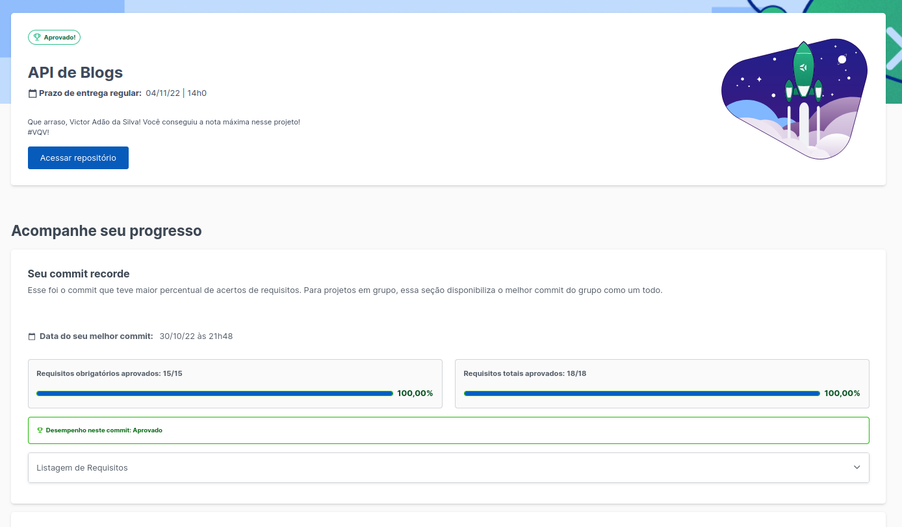

# Projeto Blogs Api

### 🔰Como iniciar o projeto na sua máquina🔰

- ``` git clone git@github.com:VictorSilva27/Project-Blogs-Api.git ``` (Clonar o repositório no local)
- ``` cd Project-Blogs-Api ``` (Entrar no repositório clonado)

### 🔰Rodando com Docker🔰
- ``` docker-compose up -d --build ``` (Instalando as images do NodeJs e MySql)

Em caso de Erro de funcionamendo de Porta, altere as linhas das ports no arquivo ``` docker-compose.yml ```
- ``` docker exec -it blogs_api bash ``` (Entrando no container)
- ``` npm install ``` (Baixando as dependências do projeto)
- ``` npm start ``` (Iniciando o projeto)

No seu terminal deve estar aparecendo algo como ``` Rodando na porta 3000 ```

### 🔰Criando e populando as tabelas do banco🔰

- ``` npm run prestart ```
- ``` npm run seed ```

Agora copie e cola o link abaixo, no seu navegador: 
- ``` http://localhost:3000/login ```

### 🔰Nota do projeto🔰

